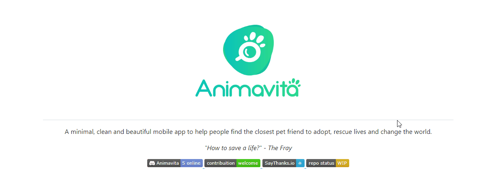

# Projeto com README
Um projeto de teste com um arquivo README 🚀

[]

## Tecnologias utilizadas
-HTML
-CSS
-JS

## Como utilizar

1 - Clone pro o projeto
```
git clone <url>
```

2 - Acesse a pasta do projeto
```
cd repositorio-com-readme
```